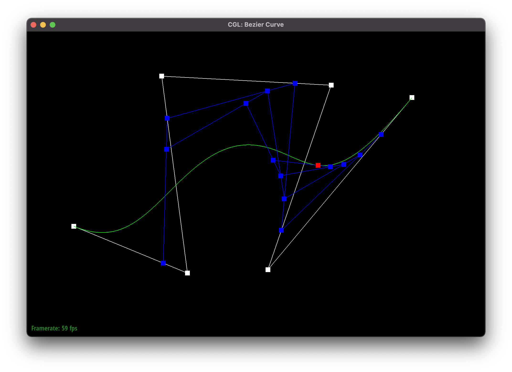
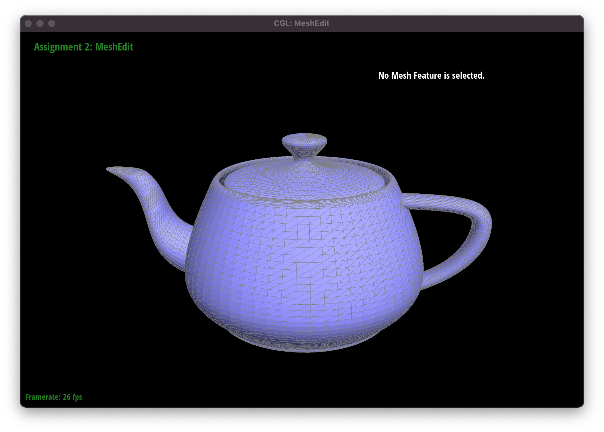
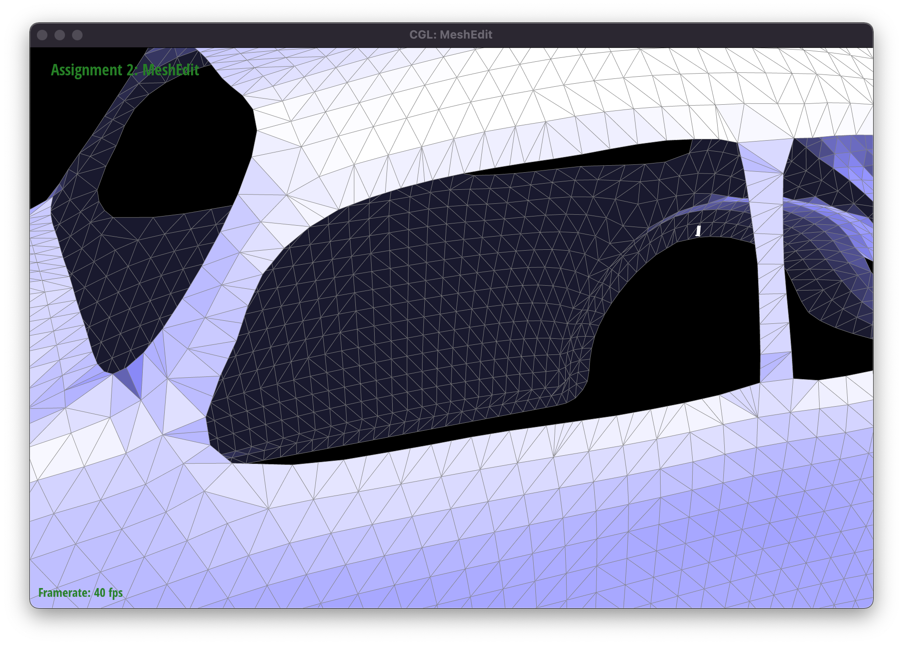

---
# Feel free to add content and custom Front Matter to this file.
# To modify the layout, see https://jekyllrb.com/docs/themes/#overriding-theme-defaults

layout: default
classes:
  - landing
title: "Project 2: Meshedit"
---

# Overview

In this project, we've built a program for drawing Bezier curves/surfaces and have also explored triangle meshes using half-edge data structure. 

Built by Raiymbek Akshulakov & Yersultan Sapar. 

# Section I
***

## Part 1: Bezier Curves with 1D de Casteljau Subdivision

- **Briefly explain de Casteljau's algorithm and how you implemented it in order to evaluate Bezier curves.**
    - The de Casteljau’s algorithm takes control points and recursively defines the points to draw the Bezier curve. It starts with initial control points and uses linear interpolation to come up with intermediate points on the line segments (defined by control points), which are used as control points on the next level of recursion. The algorithm ends when there is one point left, which is used as a point on the final curve.
    - We’ve implemented `BezierCurve::evaluateStep` method, which execute one level of recursion of the de Casteljau’s algorithm. Adjacent points in the input define a line segment, on which we create an intermediate point with the provided parameter `t`.
- **Take a look at the provided `.bzc` files and create your own Bezier curve with **6** control points of your choosing. Use this Bezier curve for your screenshots below.**
    - We've defined the Bezier curve with the following parameters:
    ```
    6
    0.200 0.800   0.500 0.150   0.400 0.600   0.700 0.450  0.900 0.200 1.000 0.900
    ```
- **Show screenshots of each step / level of the evaluation from the original control points down to the final evaluated point.**

<p float="middle"> 
    
    
    
    
    
    
</p>

- **Show a screenshot of a slightly different Bezier curve by moving the original control points around and modifying the parameter *t* via mouse scrolling.**
    
    <center>Modified Bezier curve</center>

## Part 2: Bezier Surfaces with Separable 1D de Casteljau

- **Briefly explain how de Casteljau algorithm extends to Bezier surfaces and how you implemented it in order to evaluate Bezier surfaces.**
    - Instead of using a linear vector of control points as an argument, the extension of de Casteljau’s algorithm to surfaces accepts a matrix of points, where each row represents a set of control points for a single Bezier curve. After building out all these curves using parameter `u`, the algorithm defines another curve with control points on each of the curves. This new curve moves along with the second parameter `v`, sweeping out the result surface.
    - `BezierPatch::evaluateStep` method simply extends from the previous part, but works with control points in 3D.
    - `BezierPatch::evaluate1D` method fully executes the algorithm, returning a single point on the curve. It feeds the result of the previous recursive step (obtained with `evaluateStep`) to the next one and relies on the invariant that each step decreases the number of control points by 1.
    - `BezierPatch::evaluate` method evaluates a separate curve for each row of the control points with parameter `u` and then evaluates the final curve for the surface using the parameter `v`.
- **Show a screenshot of `bez/teapot.bez` (not `.dae`) evaluated by your implementation.**
    
    <center>Teapot with Bezier surface</center>


# Section II
***

## Part 3: Area-Weighted Vertex Normals

- **Briefly explain how you implemented the area-weighted vertex normals.**
    - Given the point, we firstly obtain its `HalfedgeCIter` iterator. We will iterate over all neighboring triangles, until we come back to the original half edge. Using the vertices of each triangle, we compute two vectors and calculate their cross-product, which yields the normal for this triangle. We sum up all such normals and normalize it before returning the answer. This gives exactly the area-weighted normal at the given vertex, since each normal is proportional to the area of its respective triangle. 
- **Show screenshots of `dae/teapot.dae` (not `.bez`) comparing teapot shading with and without vertex normals. Use Q to toggle default flat shading and Phong shading.**
<p float="middle"> 
    
     
</p>

## Part 4: Edge Flip

- **Briefly explain how you implemented the edge flip operation and describe any interesting implementation / debugging tricks you have used.**
    - First of all, we check if the edge is on the boundary -- in that case, we simply return it unmodified. 
    - Next up, following the picture from the spec, we simply transfer the triangle `abc` to `acd` and respectively, 
    assign the triangle `cbd` to `abd` with all of their respective pointers. 
    
    - Our implementation firstly made sure that half-edge pointers of the faces `abc` and `cbd` were assigned to the half-edge of `cb` and its twin, respectively. This helped us to ensure that these faces will stay associated with the same edge "object", when it eventually becomes the edge `ad`. Then we "looped" over the vertices to transfer their pointers. 

- **Show screenshots of the teapot before and after some edge flips.**
<p float="middle"> 
    
     
</p>

- **Write about your eventful debugging journey, if you have experienced one.**
    - There were a lot of pointer assignments, so after the initial futile attempts to keep track of things in mind, we've simply given up on that approach. Instead, we've heavily utilized pen and paper to ensure the correct order of the changes we make. We've divided the process into several steps and if something did not work, we've tried to backtrack using our diagram. 

## Part 5: Edge Split
- **Briefly explain how you implemented the edge split operation and describe any interesting implementation / debugging tricks you have used.**
    - We simply return a new vertex if the edge is on the boundary. Otherwise, similar to the previous part, we associate the faces `abc` and `cbd` with appropriate half-edges. Following the picture from the spec, we transfer the triangle `abc` to `amc`, `cbd` to `cmd`. 

     
    - Then we create a middle vertex `m` along the split and set its position at the midpoint between the position of two respective halfedges. We also create two new faces for triangles `amb` and `mdb` and set up their half-edge pointers accordingly.
    - Finally, we create the new half-edges (for `am`, `md`, and `mb` line segments) and set their parameters. 
- **Show screenshots of a mesh before and after some edge splits.**
<p float="middle"> 
    
     
</p>

- **Show screenshots of a mesh before and after a combination of both edge splits and edge flips.**
<p float="middle"> 
    
     
</p>

- **Write about your eventful debugging journey, if you have experienced one.**
    - If the previous part was just about pointer reassignment, in this task we also had to create new objects. The process was similar and we once again drew a diagram to visualize the structure of all half-edges and faces. At the end, we did not know that we need to create an instance of `edgeIter` class as well - we thought two half edges should be enough. However, while splitting the edge, only one of the four central edges (edges that end in the newly created vertex) had appeared. Later in the code, we have figured out that we need to create an instance of `EdgeIter` class too, so after that change, everything was resolved.

- **If you have implemented support for boundary edges, show screenshots of your implementation properly handling split operations on boundary edges.**
    - We've splitted the boundary edges on the triangles that surround the window of the beetle car:
     
    <center>Beetle mesh with boundary edges split</center>

    

## Part 6: Loop Subdivision for Mesh Upsampling
- **Briefly explain how you implemented the loop subdivision and describe any interesting implementation/debugging tricks you have used.**
    - We've mostly followed the prompt: pre-compute the new positions for all vertices according to the given formula, then split the existing edges. Following up by flipping the edges that connect old and new vertices, we've updated the final positions of all vertices. 
- **Take some notes, as well as some screenshots, of your observations on how meshes behave after loop subdivision. What happens to sharp corners and edges? Can you reduce this effect by pre-splitting some edges?**
    - Some meshes start to lose their original form (as the cube below), since they are not really even. 
    - Sharp edges and corners smooth out, losing their original "sharpness", as we increase the number of triangles that define the mesh. By splitting the edges, we can make the figure grow more uniformly. We should pick such edges that make the mesh more symmetric & balanced. 
    - Below we have the mesh of the cow, where the first couple of screenshots represent how "sharp" corners start to smooth out as we increase the level. The final two screenshots showcase the difference, obtained by pre-processing the mesh with splits. 
<p float="middle"> 
    
     
    
    
</p>

- **Load `dae/cube.dae`. Perform several iterations of loop subdivision on the cube. Notice that the cube becomes slightly asymmetric after repeated subdivisions. Can you pre-process the cube with edge flips and splits so that the cube subdivides symmetrically? Document these effects and explain why they occur. Also explain how your pre-processing helps alleviate the effects.**
<p float="middle"> 
    
     
    
    
</p>

- As we can see above, the asymmetry grows in mesh, as we increase the number of subdivisions. However, if we pre-process the original cube by splitting the edges on the faces of the cube (creating a "cross" on each side), we can observe that the symmetry remains as the cube subvidides: 
<p float="middle"> 
    
     
    
    
</p>

- It happens because our original cube mesh is not actually symmetric, and by pre-processing the mesh (splitting the edges on faces), it actually becomes equivalent at all sides. This ensures a symmetric growth while subdivisions occur.

## The website link

The website link is [https://cal-cs184-student.github.io/sp22-project-webpages-yersultan-17/](https://cal-cs184-student.github.io/sp22-project-webpages-yersultan-17/)

