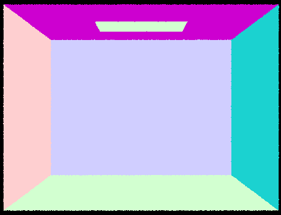

---
# Feel free to add content and custom Front Matter to this file.
# To modify the layout, see https://jekyllrb.com/docs/themes/#overriding-theme-defaults

layout: default
classes:
  - landing
---

# Project 3-1: Raytracer -- Overview

In this project, we've implemented the raytracer with a pathtracing algorithm. Ray intersection tests, acceleration using BVH trees, illumination, sampling, Monte Carlo estimation and many more concepts from the class were heavily used in this project. While working on the it, we've encountered many problems with making sure that images correspond to the examples in the spec. Examining the differences, we could reinforce the concepts learned in the class and truly understand what part (whether it is intersection, shadows or bounding box errors) might be causing the problem. In short, we loved this assignment and looking forward to its follow-up!

Built by Raiymbek Akshulakov & Yersultan Sapar. 

# Part 1: Ray Generation and Scene Intersection
- **Walk through the ray generation and primitive intersection parts of the rendering pipeline.**
    - **Ray generation:**
        - generating the ray in the world space: we firstly convert the provided image space coordinates into the *virtual camera sensor space* coordinates*.* Then, we create the ray with the provided origin and its direction (a vector from camera origin to the sensor point), while taking care of camera-to-world rotations.
        - tracing rays for each pixel: we sample in the unit window `(x, y) → (x + 1, y + 1)` and generate the ray with sampled coordinates (normalizing them in advance). For this part of the assignment, the color is computed as the average radiance of all samples.
    - **Ray-triangle intersection:**
        - Conceptually, we run the Möller-Trumbore algorithm and verify its output. If the output parameters are valid, the ray intersects the triangle, so we update the `max_t` attribute of the ray and populate the `Intersection` struct according to the spec (where normal is the interpolation of the vertex normals with the barycentric coordinates of the intersection point).
    - **Ray-sphere intersection:**
        - Firstly, we solve the quadratic equation to get two `t` parameters where the ray intersects the sphere. If the parameters are valid, we choose the smallest of them as the final `t` parameter. Similarly to triangle intersection part, we update `max_t` and `Intersection` struct (this time, the normal is the normalized vector from sphere origin to the intersection point).
- **Explain the triangle intersection algorithm you implemented in your own words.**
    - We’ve implemented the Möller-Trumbore algorithm, which combines the ray-plane intersection with the point-in-triangle test. The implementation details are taken from the Discussion 5 and below is the screenshot that describes the notation of vectors. It was much more convenient to use Möller-Trumbore algorithm than to implement ray-plane intersection and point-in-triangle tests separately. 
    - The algorithm essentially solves the equation which allows us to get the `t` parameters of the ray, where it potentially intersects the triangle, as well as the barycentric coordinates of the intersection point. If the obtained parameters satisfy the constraints (`t >= 0` and the barycentric coordinates must be between `0` and `1`), then we have successfully found the intersection point. 
     
    
Notation for Möller-Trumbore's algorithm
  

- **Show images with normal shading for a few small *.dae* files.**
    
 
    
     
    

# Part 2: Bounding Volume Hierarchy

- **Walk through your BVH construction algorithm. Explain the heuristic you chose for picking the splitting point.**
    - Similar to the starter code, we firstly compute the overall bounding box based on all of the primitives passed in (based on iterators). While computing the bounding box, we also compute the average centroid of that bounding box since our heuristic treats the average centroid as the splitting point across the longest axis. Average centroid (on the longest axis) is the natural choice to evenly distribute the primitives on the binary tree.
    - We construct the BVH tree using the following algorithm:
        - if the number of primitives can be fully contained in the node (number does not exceed `max_leaf_size`), then we assign the `start` and `end` pointers of the node and return it as a leaf
        - otherwise, we have to branch out based on the splitting point. We compute the longest axis and partition the primitives into two sets, using the appropriate coordinate (the longest axis) of the average centroid as the split point. Finally, we recursively build the left and right branches of the tree, where each branch only contains primitives from a single partition.
        - There is a special case where the partition brings all of the primitives to only one set, leaving the second one completely empty. In order to not get into an infinite recursion while traversing the BVH tree, we simply allocate one primitive to left/right node from the partitioned set.
- **Show images with normal shading for a few large *.dae* files that you can only render with BVH acceleration.**
    
 
    
    
    
    

- **Compare rendering times on a few scenes with moderately complex geometries with and without BVH acceleration. Present your results in a one-paragraph analysis.**
    - We’ve used the following scenes in our analysis: *cow (5856 primitives), maxplanck (50801 primitives), CBlucy (133796 primitives)*. Below are the results of rendering the images with and without the optimization.
    - **Without BVH implementation:**
        - Cow: *23.9482s* of rendering time, avg *0.0200* million ray/s.
        - Maxplanck: *261.5671s* of rendering time,  avg *0.0018* million ray/s
        - Cblucy: *725.3452s* of rendering time, avg *0.0006* million ray/s
    - **With BVH implementation:**
        - Cow: *0.0429s* of rendering time, avg *7.8517* million ray/s.
        - Maxplanck: *0.0622s* of rendering time,  avg *5.6921* million ray/s.
        - Cblucy: *0.0476s* of rendering time, avg *6.2130* million ray/s.
    - The starter code just stores all of the primitives in a single node, not building out the tree at all. Ray intersection complexity would be linear in this case, while the acceleration based on a simple heuristics should bring us to the logarithmic asymptotic since we avoid a lot of redundant intersection tests. From the analysis, we could see clearly see the improvement in performance.

# Part 3: Direct Illumination
- **Walk through both implementations of the direct lighting function.**
    - Direct lighting is done by simulating a ray, going through the path camera-object-lighting source. In the first iteration, we sample `n` rays and once the ray reaches an object, we uniformly sample the next direction from the hemisphere around the normal. Then we check whether the ray hit the light source or not by taking the emission from the next intersection.
    - Once we are done with calculating the radiances for all the `n` directions of our samples, we can calculate the estimate for the total amount of light coming into the surface and estimate what is going to be the radiance toward the camera. In this case, we assume all the surfaces are Lambertian (they defuse the light).
    - In the importance sampling, instead of sampling directions uniformly from of the hemisphere, we look only in the directions that intersect the light source. Finally, we just need to count how many of those rays hit something before reaching the light, which is going to give an insight on the intensity of the shadow (if there is one).
- **Show some images rendered with both implementations of the direct lighting function.**
    - We've rendered *CBbunny.dae* first with hemisphere sampling, then with importance sampling.
    
 
    
     
    

- **Focus on one particular scene with at least one area light and compare the noise levels in soft shadows when rendering with 1, 4, 16, and 64 light rays (the `l` flag) and with 1 sample per pixel (the `s` flag) using light sampling, not uniform hemisphere sampling.**
    
 
    
     
    
     
    

- **Compare the results between uniform hemisphere sampling and lighting sampling in a one-paragraph analysis.**
    - From the images we can see that the direct lighting achieves much smoother walls and the object, while with hemisphere sampling, there is a lot of noise. This can be explained by the fact that in those points, there were many lights in directions that do not go in the direction of light source(s) (they simply hit the wall and finish there since we are bouncing off only once in this part). Therefore, there are a lot of “non-shadow” rays that contribute to the noise. In the case of direct lighting, we are only sampling in the direction of the light, so we are only going to get either the light rays or shadow rays.

# Part 4: Global Illumination
- **Walk through your implementation of the indirect lighting function.**
    - So far we have implemented zero bounce and one bounce illumination. We can go further and get the effect where the colors of surrounding objects can affect the color of light bouncing.
    - In this case for each ray, we firstly calculate the one bounce emission for all the future intersections of the ray. Then we use recursion to further trace the bouncing rays (which are computed similarly to the Part 3). Of course, we can go on and trace the ray forever. We need to stop somewhere while making sure to not introduce any bias in our estimation.
    - For that, we use so-called Russian roulette technique, where with certain probability `p` we can end the tracing. However, the expected value might be inaccurate as an effect of terminating the tracing (because of Russian roulette) early. This can be addressed by simply dividing our estimation result by `p`.
- **Show some images rendered with global (direct and indirect) illumination. Use 1024 samples per pixel.**
    
 
    
    
    

- **Pick one scene and compare rendered views first with only direct illumination, then only indirect illumination. Use 1024 samples per pixel. (You will have to edit `PathTracer::at_least_one_bounce_radiance(...)` in your code to generate these views.)**
    
 
    
    
    

- **For *CBbunny.dae*, compare rendered views with `max_ray_depth` set to 0, 1, 2, 3, and 100 (the `m` flag). Use 1024 samples per pixel.**
    
 
    
    
    
    
      
    

- **Pick one scene and compare rendered views with various sample-per-pixel rates, including at least 1, 2, 4, 8, 16, 64, and 1024. Use 4 light rays.**
    
 
    
    
    
    
    
        
      
    

# Part 5: Adaptive Sampling
- **Walk through your implementation of the adaptive sampling.**
    - Adaptive sampling aims to speed up the rendering process by taking advantage of pixel’s convergence. Similar to the implementation from Part 1, we start by trying to sample rays `num_samples` times. For each sample, we compute the illuminance of sampled radiance and additionally keep track of two sums: the sum of illuminances and the sum of squared illuminances.
    - Each `samplesPerBatch` times, we compute the mean and variance of our samples and use them to determine the convergence of the pixel, `I = 1.96 * std_dev/sqrt(n)`. If the pixel has converged with 95% confidence (we satisfy the inequality `I <= maxTolerance * mean`), we stop sampling rays and move on to the next pixel.
    - Since each pixel gets a different number of samples, we get the sample rate image that is not fully red (in which case, every pixel would get the maximum number of samples).
- **Pick one scene and render it with at least 2048 samples per pixel. Show a good sampling rate image with clearly visible differences in sampling rate over various regions and pixels. Include both your sample rate image, which shows your how your adaptive sampling changes depending on which part of the image you are rendering, and your noise-free rendered result. Use 1 sample per light and at least 5 for max ray depth.**

 
    
     

## Collaboration
- This project was built by the team of two and we think collaboration went really well. Yersultan focused
more on intersection and BVH implementation, while Raiymbek worked on illumination parts. We've completed the Adaptive Sampling together, which really helped us to fully understand each other's parts during the debugging process. We've learned that writing documented code with detailed comments is a big part of successful collaboration, since it helps each team member to easily reference the code written by the other teammate. 

## The website link

The website link is [https://cal-cs184-student.github.io/sp22-project-webpages-yersultan-17/](https://cal-cs184-student.github.io/sp22-project-webpages-yersultan-17/)

