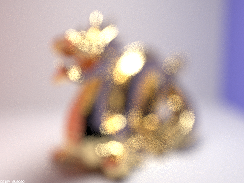

---
# Feel free to add content and custom Front Matter to this file.
# To modify the layout, see https://jekyllrb.com/docs/themes/#overriding-theme-defaults

layout: default
classes:
  - landing
---

# Project 3-2: Raytracer
***

# Overview

This project served as an extension to the previous project 3-1. We’ve implemented more sophisticated materials (glass and mirror to be precise) and depth-of-field effects for our camera, which refer to parts 1 and 4, respectively. Our approach was to use staff’s binary for 3-1 implementation and fully focus on the code necessary for 3-2. We have not encountered significant problems and were able to complete this project in relatively small amount of time. 

Built by Raiymbek Akshulakov & Yersultan Sapar. 

## Part 1. Implementation overview
In Part 1, we've added new BSDFs to correctly render some non-Lambertian surfaces such as mirrors and glass with realistic reflections and refractions. This part had multiple sub-parts:   

**Part 1.1: Reflection**
- In this subpart, we start the implementation of the mirror material. It is easier than glass because it only requires reflection. Our implementation reflects `w0` around the normal of the mirror which is equal to `(0,0,1)` in the local coordinate system. 
    
 
    
    

- To get the reflected direction we need to find the corresponding matrix for reflection around the normal vector. The corresponding matrix can be thought of as a rotation matrix that rotates points around the normal by `180` degrees, therefore it is a linear transformation. Since it is a linear transformation, we can calculate the matrix values by looking at the transformation outputs of the basis vectors: `(1,0,0)` goes to `(-1,0,0)`, `(0,1,0)` goes to `(0,-1,0)` and `(0,0,1)` goes to `(0,0,1)`. The final rotation matrix looks like: 
    
 
    
    

**Part 1.2: Mirror Material**
- To finalize the implementation of the mirror material, we need to complete `sample_f` function. Here, we firstly set the outgoing ray direction, then set the appropriate probability of this direction and return the right reflectance value. The value of the outcoming direction can be determined by the function `reflect` from the previous step. Regarding the `pdf`, its value is `1` (since it is a mirror with only one outcoming ray). To return the right reflectance value, we need to divide it by the `abs_cos_theta(w1)` to cancel out the effect of `at_least_one_bounce_radiance`, where we've multiplied by the cosine of `theta`. 

**Part 1.3: Refraction**
- Here, we firstly identify if we are entering/exiting the glass (we check the `z` coordinate of `w0`). Then, we compute `eta` value which helps to determine if the refraction happens at all. If `(1 - eta^2 * (1 - wo.z^2) < 0` then it means there is no refraction and we just return `false` as a result. 
- Afterwards, we consider `w0` in spherical coordinates and according to the spec, use Snell's law to compute the coordinates of the outcoming ray. 
 
**Part 1.4: Glass Material**
- We use Schlick's approximation to account for **both** refraction and reflection. Before even calculating it, we need to check whether there is any refraction at all (we can check it by using the code from the previous part). If there is no refraction, we just return the reflection -- just call mirror material's `sample_f` function. 
- If there is refraction happening, we compute Schlick's coeffficient with the formula from the spec -- we treat it as the probability of the reflection. If we are not lucky with reflection, we decide to refract the light, setting `pdf` to `1-R` and return the transmittance multiplied by `pdf` over the cosine theta (to cancel out calculations in `at_least_one_bounce_radiance`) and also divide it by `eta^2` to account for the case when light concentrates when it enters high reflection index material.
    
 
    
    

## Part 4. Implementation overview

In Part 4, we’ve implemented the depth-of-field effects. Following the algorithm outlined in the spec, we sample the point from the lens disk and compute the intersection of the ray with the focus plane. Using that information, we compute the ray that goes through the lens and return it as a result. Changing `lensRadius` argument to anything other than `0` (ideal pinhole camera) activates `generate_ray_for_thin_lens` function which we’ve implemented in this part. The image below from the spec shows three planes (image plane, lens and the focus plane) that we use in this part. 

 

# Part 1: Mirror and Glass Materials

- **Show a sequence of six images of scene `CBspheres.dae` rendered with `max_ray_depth` set to 0, 1, 2, 3, 4, 5, and 100. The other settings should be at least 64 samples per pixel and 4 samples per light. Point out the new multibounce effects that appear in each image. Explain how these bounce numbers relate to the particular effects that appear.**
    
 
    
    
When we start with 0 as the maximum ray depth, we get a scene where the only light we have is the one that comes from the light source.

    
    
When m = 1, the objects that are directly illuminated show-up, but our spheres are still dark.

    
    
When m = 2, we get our mirror sphere, while the glass sphere is still dark since it requires an additional bounce.

    
    
When m = 3, both spheres show up. However, the reflection of the glass sphere in the mirror remains dark.

    
    
When m = 4, reflection of the glass is now correct. We also start projecting the light to the purple wall.

    
    
When m = 5, we get slighly brigther image.

    
    
When m = 100, it does not really differ from the previous image, aside from again being a little brigther.

    

# Part 4: Depth of Field

- **In a few sentences, explain the differences between a pinhole camera model and a thin-lens camera model.**
    - In the previous project, we haven’t considered the impact of the focus on our renders since we’ve simply assumed that everything is in focus. This is how ideal pinhole cameras would operate. The reality, as usual, is much more complicated: real cameras and human eye only focus on objects that are at certain `focalDistance`, because they have a lens. The radius of the lens (and also thickness, but we’ve omitted that in this project) also affects what objects remain in focus.
- **Show a "focus stack" where you focus at 4 visibly different depths through a scene.**
    - The aperture is constant at `0.04`, while the focal distance takes up the following values: `1, 2, 2.5, 3`. As we can see from the images, as we increase the focal distance, the focus shifts across the dragon model. 
    
 
    
    
    
    
    

- **Show a sequence of 4 pictures with visibly different aperture sizes, all focused at the same point in a scene.**
    - With the set of images below, the focal distance is fixed at `2.5` and the lens radius is set to the following values: `0.01, 0.03, 0.05, 0.08`. The larger lens causes more blur since the focused area is smaller. 
    
 
    
    
    
    
    

# Collaboration

We’ve worked on different parts, since it effectively utilized our strengths from Part 3-1. Raiymbek worked on Part 1 (since he had more experience working with illumination from the previous project), while Yersultan worked on Part 3 (since he mostly worked on ray generation tasks before). In order to make sure we learn each other’s parts, we’ve wrote the write-up and went through the code logic together. We think collaboration went well both from learning and time management perspectives. 

# The website link

The website link is [https://cal-cs184-student.github.io/sp22-project-webpages-yersultan-17/](https://cal-cs184-student.github.io/sp22-project-webpages-yersultan-17/)

