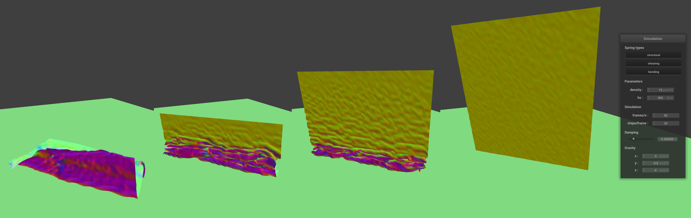
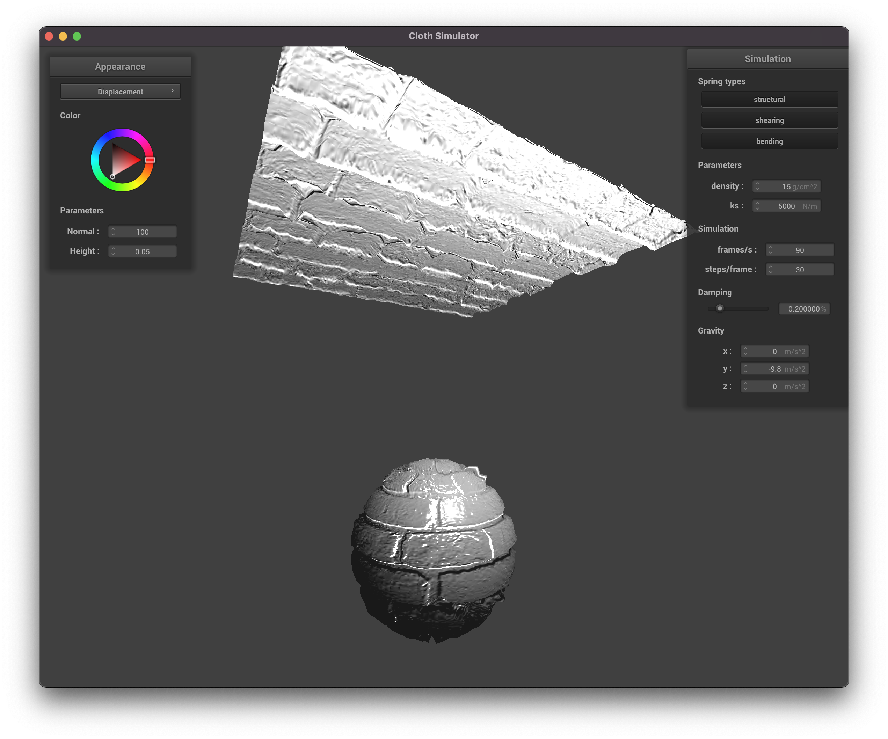

---
# Feel free to add content and custom Front Matter to this file.
# To modify the layout, see https://jekyllrb.com/docs/themes/#overriding-theme-defaults

layout: default
classes:
  - landing
---

# Project 4: Clothsim
***

# Overview

For this project, we’ve built the simulator of a cloth piece, expressed as a system of point masses and springs. Using this system, we were able to apply physical constraints on the cloth and use Verlet integration to simulate its movement over time. To decorate our cloth and primitives, we've worked on multiple shaders using GLSL. Additionally, we’ve implemented cloth collision with other primitives, took care of cloth’s self-collision and simulated the cloth’s behavior when the wind effect is applied. The main challenges came from properly approximating the wind effect and making sure that cloth stays above the surface of collision objects. We were able to address them through careful debugging and tweaking the small offsets for point mass positions. 

Built by Raiymbek Akshulakov & Yersultan Sapar.

# Part 1: Masses and springs

In this part, we’ve worked on building the grid that represents the cloth. Firstly, we’ve put together the point masses on their respective positions and then connected them using springs. We’ve added all of the springs given by 3 different type constraints and simply enable/disable them using buttons on the interface. 

- **Take some screenshots of *scene/pinned2.json* from a viewing angle where you can clearly see the cloth wireframe to show the structure of your point masses and springs.**
    <p float="middle"> 
    
    
    </p>
- **Show us what the wireframe looks like:**
    - **(1) without any shearing constraints**
    <p float="middle"> 
    
    </p> 
    - **(2) with only shearing constraints**
    <p>
    
    </p>
    - **(3) with all constraints**
    <p>
    
    </p>

# Part 2: Simulation via numerical integration

This part allows external forces and internal spring tensions to affect our cloth-grid. We’ve firstly computed the total force from external accelerations (gravity) and also applied spring connection forces using Hooke’s law. Afterwards, we’ve used numerical integration to compute the change of position of each point mass. Finally, we constrain spring lengths ([using deformation constraint from SIGGRAPH 1995 Provot paper](https://www.cs.rpi.edu/~cutler/classes/advancedgraphics/S14/papers/provot_cloth_simulation_96.pdf)) to prevent their unreasonable deformation. 

- **Experiment with some the parameters in the simulation. To do so, pause the simulation at the start with `P`, modify the values of interest, and then resume by pressing `P` again. You can also restart the simulation at any time from the cloth's starting position by pressing `R`.**
    - **Describe the effects of changing the spring constant `ks`; how does the cloth behave from start to rest with a very low `ks`? A high `ks`?**
        - **Note:** all of the screenshots below are without self-collision implementation, which belongs to Part 4.
        - With low `ks` value, it is easier to deform the cloth and therefore it folds a lot in the rest position. We set the constant as `ks = 50`.
            <p float="middle"> 
            
            </p>
        - For high `ks`, since the kinetic strength is strong, it is hard to extend or bend it, therefore it does not change the form much as it falls down to the rest position. We can observe that there is not much folding happening at the rest position. Here, we've set `ks = 50000`.
            <p float="middle"> 
            
            </p>
    - **What about for `density`?**
        - With low `density`, the point masses are very light, so there is also a low variance in the cloth deformation. We set `density` to `1`, with `ks = 500` (different than default value). 
            <p float="middle"> 
            
            </p>
        - With high `density`, the situation is reversed: there is more deformation because the cloth weighs more. We set `density` to `1500`, with `ks = 500` (different than default value). 
            <p float="middle"> 
            
            </p>
    - **What about for `damping`?**
        - With low `damping`, the Verlet update is going to be big. Therefore, the cloth just swings back and fourth around the pinned points.
            <p float="middle"> 
            
            </p>
        - With high `damping`, updated position during Verlet integration will be very close to the current position, hence the cloth falls down very slowly and does not swing around the pinned points.
            <p>
            
            </p>
- **For each of the above, observe any noticeable differences in the cloth compared to the default parameters and show us some screenshots of those interesting differences and describe when they occur.**
    - All of the screenshots and description of differences are in the bullet point above.
- **Show us a screenshot of your shaded cloth from *scene/pinned4.json* in its final resting state! If you choose to use different parameters than the default ones, please list them.**
    - The parameters are set to defauls: `density = 15, ks = 5000`.
        <p>
        
        
        </p>

# Part 3: Handling collisions with other objects

Here we’ve explored collisions of the cloth with two 3D primitives: sphere and plane. Both of these objects have their respective functions for rendering and collision with a single point mass. The implementation of the latter was up to us, where we’ve calculate the correction vector for the position of a single point mass from the cloth, so it would be located on the surface of the collision object after collision. 

- **Show us screenshots of your shaded cloth from *scene/sphere.json* in its final resting state on the sphere using the default `ks = 5000` as well as with `ks = 500` and `ks = 50000`. Describe the differences in the results.**
    - **Note:** all of the screenshots below are without self-collision implementation, which belongs to Part 4.
    - When the `ks` coefficient is high, the cloth's rigidness is increased, which in turn decreases the amount of folds. While with low `ks`, it is very easy to deform the cloth, which in turn makes it fold a lot around the sphere. Usually the amount of “foldness” is proportional to the `ks` coefficient.
    - Here, `ks` is set to `5000` (default).
        <p>
        
        </p>
    - Here, `ks` is set to `500`.
        <p>
        
        </p>
    - Here, `ks` is set to `50000`.
        <p>
        
        </p>
- **Show us a screenshot of your shaded cloth lying peacefully at rest on the plane. If you haven't by now, feel free to express your colorful creativity with the cloth! (You will need to complete the shaders portion first to show custom colors.)**
    - We've used the mirror shader here.
        <p>
        
        </p>

# Part 4: Handling self-collisions

The self-collision occurs when a point mass on the cloth is too close to the other point masses. To fix that, we apply a modifying force to push that point mass away from the others. To quickly lookup the nearest point masses, we divide the space into discrete bounding boxes and use spatial hash map to store point masses that are in the respective bounding box. 

For our hash function, we've used [Cantor pairing function](https://en.wikipedia.org/wiki/Pairing_function#Cantor_pairing_function) to map three coordinates that represent a position of the point mass into a single integer. After successfully building a hash map, we run through all point masses and check if each collides with ones that are in its bounding box. If that is the case, we compute the correction force that pushes the point mass away. 

- **Show us at least 3 screenshots that document how your cloth falls and folds on itself, starting with an early, initial self-collision and ending with the cloth at a more restful state (even if it is still slightly bouncy on the ground).**
    - Below are the four screenshots of folding the cloth, starting from fully stretched position to the eventual restful state on the plane. 
        <p>
        
        
        
        
        </p>
- **Vary the `density` as well as `ks` and describe with words and screenshots how they affect the behavior of the cloth as it falls on itself.**
    - In the screenshots below, the cloth's falling down is happening from right to left. 
    - As was outlined before high `ks` and low `density` give a more rigid cloth which means there would be less self-collisions, and as a result cloth falls down in a more structured way.
        - Here `ks` is set to `50000`.
            <p>
            
            </p>
        - Here `density` is set to `1`.
            <p>
            
            </p>
    - On the other hand, low `ks` and high `density` do allow for complex folds of the cloth, which in turn create a lot of self collisions. We can see in the screenshots below, cloth is a lot more chaotic and less structured than in the previous bullet point.
        - Here `ks` is set to `500`.
            <p>
            
            </p>
        - Here `density` is set to `100`.
            <p>
            
            </p>

# Part 5: Shaders

We’ve learned about shader programming using GLSL and implemented various shaders that use lighting, normals, mirror effects, textures, and height maps. While working, we usually used inputs provided by vertex shaders and performed our computation on the fragment shaders. 

- **Explain in your own words what is a shader program and how vertex and fragment shaders work together to create lighting and material effects.**
    - Essentially, shaders are programs that run in parallel on GPU to compute the visual description of the model. They execute various sections of main graphics pipeline and compute a 4-dimensional vector as output (final color of the pixel in our case, as output of `.frag` shader).
- **Explain the Blinn-Phong shading model in your own words. Show a screenshot of your Blinn-Phong shader outputting only the ambient component, a screen shot only outputting the diffuse component, a screen shot only outputting the specular component, and one using the entire Blinn-Phong model.**
    - Blinn-Phong shading is modified version of the Phong shading that takes into account the reflection and view directions that are greater than `90` degrees. It consists from three components: ambient, diffuse and specular lightings. The specular component makes sure that the intensity depends on the view direction. The ambient component is just a constant illumination multipled by some coefficient. Finally, we add to all of that a regular diffuse lighting so the sum has the reflection effect. Here is the formula from the lecture:
    <p float="middle"> 
    
    </p>   
    - Shading only with ambient component, where `k_a = 0.3`. It sets a constant color. 
        <p float="middle"> 
        
        </p>   
    - Shading only with diffuse component, where `k_d = 1`. It is no different than regular diffuse shading. 
        <p float="middle"> 
        
        </p>   
    - Shading only with specular component, where `k_s = 1`. There is no color but we have a bright light near mirror reflection direction. 
        <p float="middle"> 
        
        </p>   
    - Shading with all components.
        <p float="middle"> 
        
        </p>   
- **Show a screenshot of your texture mapping shader using your own custom texture by modifying the textures in `/textures/`.**
    - We've used our home country -- [Kazakhstan's](https://en.wikipedia.org/wiki/Kazakhstan) flag as the cloth texture. 
    <p float="middle"> 
    
    
    </p>
- **Show a screenshot of bump mapping on the cloth and on the sphere. Show a screenshot of displacement mapping on the sphere. Use the same texture for both renders. You can either provide your own texture or use one of the ones in the textures directory, BUT choose one that's not the default `texture_2.png`. Compare the two approaches and resulting renders in your own words. Compare how your the two shaders react to the sphere by changing the sphere mesh's coarseness by using `-o 16 -a 16` and then `-o 128 -a 128`.**
    - For the screenshots below, we are using `texture_3.png` with `normal` set to `100` and `height = 0.05`.
    - Bump shading:
        <p float="middle"> 
        
        
        </p>
    - Displacement shading:
        <p float="middle"> 
        
        
        </p>
    - Both of these shaders use modified input vertices/normals to give an illusion of details on the object. As we can see from screenshots above, bump shading highlights the "brick" structure of the texture since we have an increased height. Displacement shader modifies the vertices, so the changes are much more dramatic. One can observe that the sphere loses its perfect "roundness", adapting to the texture. 
    - For the screenshots below, we used `normal = 50` and `height = 0.1`. For low coarseness, there are not many points on the sphere itself to apply the modifications. As we increase coarseness, we can see that edges get sharper when displacement is applied, while bump does not seem to modify the sphere much visually (except that with higher coarseness, the normal modifications look more "accurate"). 
    - Bump and displacement shaders with `-o 16 -a 16`:
        <p float="middle"> 
        
        
        </p>
    - Bump and displacement shaders with `-o 128 -a 128`:
        <p float="middle"> 
        
        
        </p>
- **Show a screenshot of your mirror shader on the cloth and on the sphere.**
    <p float="middle"> 
    
    
    
    </p>
- **Explain what you did in your custom shader, if you made one.**
    - We've added another uniform to the custom fragment shader -- current time in seconds. Using that value, we compute the `vec4(cos(t), sin(2 * t), tan(t), 1)`, where `t` is the current time in seconds.
    - The final expression for the color is `out_color = vec4(1, 1, 1, 0) * ((vec4(u_light_intensity, 1) / (r * r))) + vec4(cos(t), sin(2 * t), tan(t), 1) * v_normal`. As a result, we get a scene where cloth and primitives change colors every second! 
    - If you are curious why there is a cube there, look at the extra credit part ;)
        <p float="middle"> 
        
        </p>


# Part 6: Extra Credit

This was the most fun and exciting part of the project for us. We’ve implemented collision with a new cube primitive and added the wind effect simulation (with GUI controls to change wind speed and direction).

## 1. Cube Primitive

- In order to construct the cube, we've used `GL_TRIANGLE` type of OpenGL triangle primitive. Each side of the cube is defined by two triangles stiched together, which is the same way as `plane` was constructed (except that it uses `GL_TRIANGLE_STRIP` primitive). Using triangle strips would have let us store less vertices to define the cube, but vertices on the corners would not be able to store three different normals (each for three adjacent sides). Therefore, we've decided to have 36 vertices for the cube (6 for each side, 3 per triangle) and a normal for each vertex. The final render result looks like:
    <p float="middle"> 
    
    </p>
- Similar to other collision objects, the cube parameters are also parsed from the json file. In our implementation, the `center` coordinate, the `side` length and the `friction` coefficient fully define the cube:
```
{
    "cube": {
        "center": [0.5, 0.5, 0.5],
        "side": 0.3,
        "friction": 0.5
    },
    ...
}
```
- With regards to handling cloth-cube collision, we've mostly used a similar strategy to cloth-sphere collision. The collision happens when `pm.position` is located inside the cube. When that is the case, we compute the closest point on the cube's surface to `pm.position` and treat it as the tangent point. Afterwards, we update the point mass' position with the correction vector (a vector that brings the point mass to the tangent point on cube's surface), scaled down by friction. Since cloth's springs are not impacted by the collision, you could see they fall through the cube on the cube's edges:
    <p float="middle"> 
    
    
    </p>
- Now we are able to simulate scenes with multiple primitives and handle the collision with them: 
    <p float="middle"> 
    
    </p>

## 2. Wind Force

- Our implementation approximates the wind strength as a periodic function -- `|windSpeed| * 1.4 * (cos(t * 20) + 1) + 2.8`, where `t` is the current time that starts at `0` on the first iteration and moves in `delta_t` increments. We've picked the other constants like `1.4` and `2.8` arbitrarily while experimenting. Below is the result of applying wind force on `pinned2.json` cloth:
    <p float="middle"> 
    
    </p>
- Since `cos` is periodic, we reset the global time `t` periodically to avoid the overflow. After computing the strength of the wind, we multiply it by the wind direction, which can be along any of the three axes (direction across the axis depends on the sign of the wind speed). We also introduce random movements for each point mass to accurately replicate the wind effect.
- Both wind speed and direction can be modified in the interface. In the GIF below, the direction is set to be across the x-axis:
    <p float="middle"> 
    
    </p>
- Combining mirror shading with wind and sphere collision, we can get the scenes like the one below:
    <p float="middle"> 
    
    </p>


# The website link

The website link is [https://cal-cs184-student.github.io/sp22-project-webpages-yersultan-17/](https://cal-cs184-student.github.io/sp22-project-webpages-yersultan-17/)

