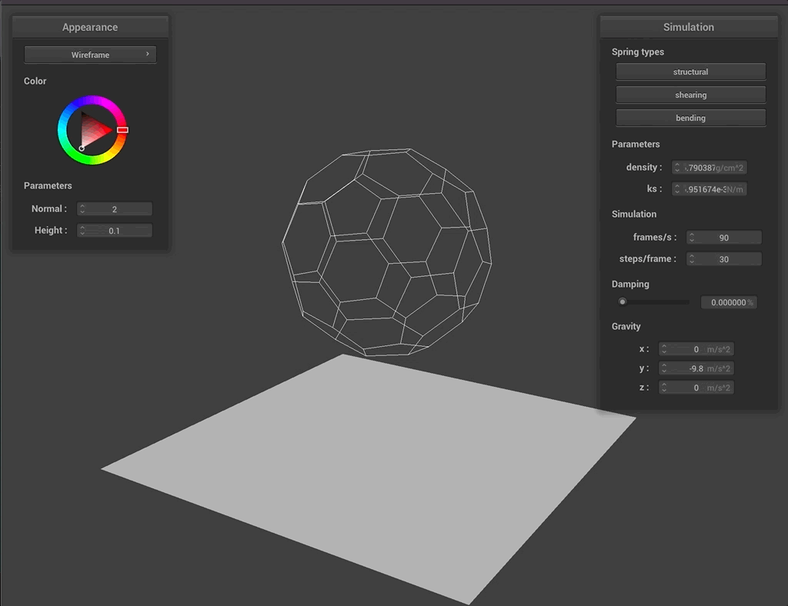
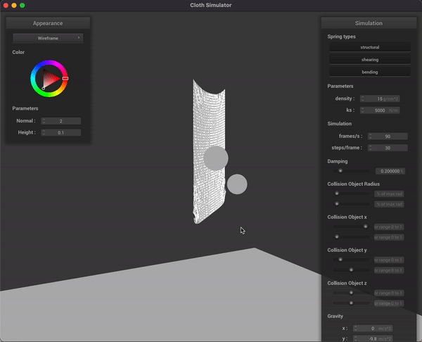

---
# Feel free to add content and custom Front Matter to this file.
# To modify the layout, see https://jekyllrb.com/docs/themes/#overriding-theme-defaults

layout: default
classes:
  - landing
---

# Soccer Ball Simulator: Milestone Report

 
    

# What was accomplished

So far, we’ve made progress on two fronts of our project: *modelling the soccer ball*, and *rigid ball trajectory simulation*. We were able to get a mass-spring system of the soccer ball in a form of a truncated icosahedron and additionally simulate the motion of the rigid ball into a simple goal net.   

# Preliminary results

## Soccer ball model

We were able to create non-rigid soccer ball wireframe by utilizing the coordinate formula for the vertices of the truncated icosahedron. In order to do this, we created our own ball class, adapting the cloth simulation pipeline from Project 4 for our ball simulation. Since the shape of a soccer ball is a truncated icosahedron, the closed form solutions for the locations of all the vertices and edges is quite involved. Note that a truncated icosahedron has `32` faces (`12` pentagons and `20` hexagons), `60` vertices, and `90` edges. Each vertex involves the intersection of two hexagons and one pentagon. 

Setting the center of the polyhedron at the origin and letting the side length be `2`, we can find the cartesian coordinates of all the vertices in terms of the golden ratio (`φ = (1 + √5)/2`). The vertices are all the even permutations of `(0, ±1, ±3)`, (`12` vertices), AND the even permutations of  `(±1, ±(2 + φ), ±2φ)` (`24` vertices), AND the even permutations of `(±φ, ±2, ±(2φ + 1))` (`24` vertices), for a total of `60` vertices. An “even permutation” refers to a rearrangement in the `x`, `y`, and `z` coordinates that involves an even number of swaps. We found these formulas on [Wikipedia](https://en.wikipedia.org/wiki/Truncated_icosahedron), and also found a useful [resource](https://polyhedra.tessera.li/truncated-icosahedron/options) that helped us create the json file with the vertex coordinates and which vertices are connected by edges.

Once we had the JSON file describing the truncated icosahedron, we created it in the simulation as a spring-mass system where each vertex had a point mass, and each edge had a spring along it. We could visualize the spring-mass system using the cloth simulator. If the ball falls down on the plane, it would just collapse on its own because there were no forces holding the ball wire mesh upright. 

 
    

In order to escape this problem, we implicitly simulated air pressure force that pushes each point mass outward from the center of the mass of our ball. The force is inversely proportional to the distance of the point to the center mass, meaning the closer the point the harder we push it. Since our points are constrained by a closed spring-mass system, they are not just exploding away. The air pressure simulation allows our ball to rest on the plane without collapsing on it. 

 
    

## Rigid Ball Motion Trajectory

In parallel to the development of the non-rigid ball simulation, we also experimented with throwing rigid spheres into a simplistic goal net represented by a pinned cloth we’ve worked on in Project 4. This cloth only has structural and bending constraints, as the net of a soccer goal typically doesn’t have diagonal strings. We were able to get the ball to trace a parabolic trajectory due to gravity, as you can see in the gif below:

 
    

# Initial schedule reflection + future adjustments

## Reflection

Our original schedule aimed to have the following items done by the milestone: 
- Start coding up the logic for physics constraints and forces and motion.
- Use Verlet integration to simulate for now (implemented in project 4 already). 
- Shoot to complete basic implementation of physics in the game simulation. 
- If time allows, start experimenting with different numerical ODE solving techniques. 

We anticipated that we would not have time to play around with numberical ODE and that is why we put "if time allows" remark in the original schedule. 

We are yet to write out all physics constraints and forces that affect the ball, though we were able to complete all bullet points above (also including tasks that were prior to the milestone: setting up C++ infrastructure, getting truncated icosahedron, spring-mass model, air pressure and wind force). 

One thing we've learned is that the equations for forces and torques have to be iterated along with the project implementation, since it is quite hard to predict the combined effect of multiple forces on the spring-mass system. We can update our future work plan by integrating physics equations iterations as a day-to-day task. 

## Next Steps

We plan to improve the ball simulation by adding proper shading to the model. In order to achieve that we need to define the half mesh structure for our point masses so that we can define the normals of each face and vertex. We also hope to experiment with more realistic models of air pressure inside the ball, and potentially add more springs and masses along the surface so that the ball behaves more like a rigid body rather than a wire frame. 

When it comes to a trajectory simulation, we need to adapt it to a nonrigid ball and experiment with different parameters to see if we can achieve various trajectories. We need to create more elaborate models to simulate a “bounce” off the ground, or the collision into the net of the goal. We also hope to create a goal shaped object (not just a single simple net) and incorporate the effects of air resistance/wind in the simulation. In addition, we hope to add more user controls and GUI elements. Finally, as time permits, we hope to experiment with different numerical ODE solving/integration techniques as discussed in the proposal.  

# Milestone Video

Here is the [link to video](https://drive.google.com/file/d/1lOnIPT0ce6zDAZINK9CC3h30PE6CSeYb/view?usp=sharing).

# Presentation Slides

Here is the [link to slides](https://docs.google.com/presentation/d/1kVjZytJ8xEWnDndSHxuBbLjZgUU8TU55KIO_gSp1i3g/edit?fbclid=IwAR3HSuAgDRHn43J6hqx9FYPAx-i0OTsUG-p_peRH0tBWt42ZB9xYcHjPHIs#slide=id.p). 

