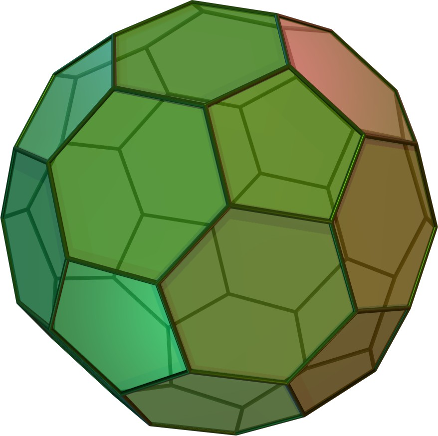
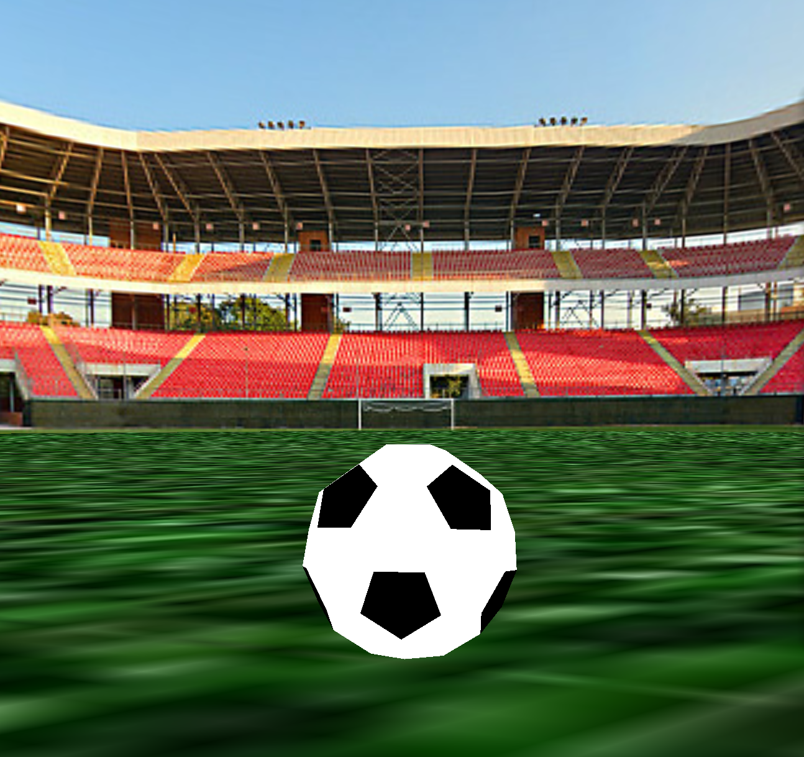

---
# Feel free to add content and custom Front Matter to this file.
# To modify the layout, see https://jekyllrb.com/docs/themes/#overriding-theme-defaults

layout: default
classes:
  - landing
---

# Soccer Ball Simulation

<p float="middle"> 
    
</p>

**Built by Team 19**: Saagar Sanghavi, Rishi Parikh, Raiymbek Akshulakov, Yersultan Sapar

# Abstract

Soccer is not only the most popular sport in the world, but it also poses many interesting graphical and physical challenges to simulate. In this project, we model and visualize the behavior of a soccer ball. We've implemented a number of features in the physics simulator, including a truncated icosahedral spring-mass system to model the ball, internal air pressure forces to keep the ball inflated, collisions, and parametrizable kicking action force, wind speed, and spin. Adding these forces together allowed us to create realistic physical qualities such as the bounce of a ball and realistic collisions between the ball and goal net. We render the scene making use of multiple shaders, modifying UV values, and setting surface normals for the ball mesh to create a visually appealing final product. We've then used the simulator to model some free kicks.

# Technical Approach

## Soccer Ball Shape: Truncated Icosahedron

Polyhedral geometry allows us to mathematically model the shape of a soccer ball. A truncated icosahedron is a semi-regular polyhedron with `32` faces, `90` edges, and 60 vertices. Of the `32` faces, `12` of them are pentagons and `20` of them are hexagons. We modeled our soccer ball as a spring-mass system in the shape of a truncated icosahedron, with point masses at each of the vertices and springs along each edge.

To understand what is a truncated icosahedron, let's first consider the icosahedron, a more familiar regular polyhedron. An icosahedron has `20` triangular faces, and `5` faces meet at each vertex, hence there are `12` vertices.

Truncation refers to the process of "chopping off" each of the edges in such a way that the resulting figure has regular polygons as all of its new faces. A truncated polyhedron has hexagonal faces in place of the triangular faces on the original icosahedron, and pentagonal faces in place of each of the vertices of the original icosahedron. Each new vertex on the truncated icosahedron is the intersection of two hexagonal faces and one pentagonal face.

<p float="middle"> 
    
    
</p>

Because of the highly symmetric nature of the truncated icosahedron, there is a rather elegant closed-from solution for the locations of the vertices. Letting `φ = (1 + √5)/2` represent the golden ratio, the vertices are all the even permutations of:
- `(0, ±1, ±3)` (`12` vertices)
- `(±1, ±(2 + φ), ±2φ)` (`24` vertices)
- `(±φ, ±2, ±(2φ + 1))` (`24` vertices)

An even permutation refers to a rearrangement in the `(x, y, z)` values that requires an even number of swaps. 

For example, given `(0, 1, 3)`, we have that `(1, 3, 0)` is an even permutation, but `(0, 3, 1)` is not. While the formula above can be derived (with difficulty) by anyone with the background of 8th grade geometry, there is a rather elegant and intuitive interpretation of the shape geometry in the context of a group structure from abstract algebra [\[1\]](#references). We've used [\[2\]](#references) to help us model the geometry and create the .json file with the vertex coordinates and vertex indices that are connected by edges.

## Air Pressure

A soccer ball is not a rigid body -- it can flex and change shape depending on external forces. In real life, a ball is pumped with air to create internal air pressure. An uninflated ball is more easily deformable with your hands and does not bounce back when hitting the ground, wheras a ball that is fully inflated is likely to spring back up and does not deform as much.

To model the effect of inflating the ball, we introduce two values: the internal air pressure and centroid of the ball. The centroid is calculated as the average `(x, y, z)` position of all the vertices of the ball. Since the model of the ball is a moving spring-mass system where each particle is simulated independently, the centroid changes over time. The internal air pressure is a scalar parameter that determines how much internal force there is acting on the vertices, pushing the vertices away from the center. We define the force acting on each mass in the ball as:

```
direction = pm.position - centroid

magnitude = air_pressure / direction.norm()

F_air(pm, centroid) = direction.unit() * magnitude
```

This pushes every element in an outwards direction at a magnitude proportional to the air pressure inside the ball, while applying a greater force to point masses closer to centroid of the ball. The mathematical intuition behind this is that if the volume of the ball shrinks (radius decreases) because the ball is deformed, then the outward pressure on the deformed portion will increase because the total amount of air in the ball remains the same.

<p float="middle"> 
    
    
    
</p>

Our simplified model of air pressure holds up well under various conditions. Above, we demonstrate three scenarios. We see that with no air pressure, the ball collapses in on itself - indicating the need for some internal force to keep the ball inflated. As we increase air pressure, we model what is a "flat" ball. The ball has more flex and bounce, and energy is lost in this process. Finally we look at a fully inflated ball (high internal air pressure). This ball has little noticable deformation, and retains most of the energy as it returns to a similar height.

## External Forces: Wind

In soccer, external wind is a big factor in kicking a ball. Many times a gust of wind will blow a ball off course, and soccer players must account for this when aiming their shot. Wind is modeled as a “push” force which affect particles depending on the direction from which it approach the object. The main idea is that wind applies a stronger force on particles it hits head on, and the particles on the far side of the ball are blocked from the wind and experience no wind force. We came up with the following formula to characterize the wind force applied. Here, `F_wind` is a tunable parameter defined by a direction vector (gets normalized) and scalar magnitude.

```
F_app = dot(–F_wind, (pt.position – centroid)) * F_wind
```

<p float="middle"> 
    
</p>

The dot product between wind and direction from centroid gives us a `cos(theta)` term, where `theta` is the angle between the negative direction of the wind and the vector from the centroid to the surface point. The intuition is that if this angle is small (ie. the wind is hitting head on), the force should be larger, while if the angle is close to perpendicular (ie. the wind barely grazes the ball) then the force should be close to `0`. 

Any points on the opposite side of the ball not hit by the wind do not experience any wind force. Additionally, unlike gravity, we enforce a terminal velocity due to wind. This makes sense intuitively as wind moving at a certain speed will accelerate the ball up to that speed, but not faster.

<p float="middle"> 
    
</p>

The effects of adding wind can be seen in the curved movement of the soccer ball. Many skilled soccer players strategically kick the ball in this swooping manner during high-wind conditions to curve the ball around a defender.

## External Forces: Spin

The next feature we implemented was the spin on the ball. The ball should appear to spin around the axis (ie. the point masses of the spring-mass system need to move relative to one another), but we needed to make sure that there was no overall external force on the ball that would affect the trajectory. As a result, we needed to take special care to design forces on each particle that would cause the ball to spin, but would cancel each other out over all the particles in the ball. Letting `a` be the unit vector spin axis and `F_spin` be a tuneable parameter, the formula below is what we came up with:

```
F_app = cross(a, (pt.position – centroid)) * F_spin
```

<p float="middle"> 
    
</p>

The intuition is that by taking the cross-product, we identify a direction for each particle perpendicular to the axis of rotation and tangent to the surface at the point. The cumulative effect of these forces at each point is that they will exert a net torque on the ball (causing it to spin), but zero net force. Like with the wind, there is a terminal angular velocity of the spin.

<p float="middle"> 
    
</p>

## Collisions

The next design challenge was to model collisions between the soccer ball, ground, and goal net. Collisions between the ball (system of point masses) and the ground (plane) were relatively straightforward, and we directly used the point-plane interactions from project 4 for this part. Howevever, collisions between the ball mesh and the goal net proved to be trickier. The first challenge was with the runtime - even with spatial hashing, the large number of point masses and forces in the scene meant a lot of computation would be required. Also, the truncated icosahedral spring-mass mesh is not actually a solid object - rather, there are gaps between the springs, where the faces should be. To account for both of these problems, we decided to represent our soccer ball as a sphere for the purposes of checking for ball-to-goal collisions. To do this, we define the sphere's origin and radius as follows:

```
origin = ∑[pm.position] / n
radius = max(pm.position - centroid)
```

Using this spherical representation, we can use the point-in-sphere test to check for collisions with the goal net. Computationally, this reduces the workload to a linear number of checks, just one for each pointmass on the goal net.

<p float="middle"> 
    
</p>

Above, we can see some collisions between the ball and the goal net. The truncated icosahedron is approximated as a sphere for collision purposes and the process still looks quite natural.

# Challenges & Learning

One key challenge we faced was with compatibility issues of the simulator code on different machines. Only two of our group members' computers were able to run the code, so we would usually meet up to pair program when we wanted to test our implementations. 

The main design challenges, as discussed above, were coming up with the physics models that could accurately model the dynamics of the scene. We typically had to sketch out several ideas on paper first before trying and implementing them, and needed to be extra careful when converting our math equations into code. After implementing the base skeleton, we would often also have to continually tweak parameters to get the desired behavior/visual effects. 

Finally, making realistic-looking collisions was also very challenging but we eventually settled on the solutions described above. Some key takeaways for us from this project was that simple, intuitive models often work best in complex scenarios. We should never underestimate the power of creating simple models and allowing the physics to play out to end up with something that looks realistic.

# Results

## Textures, Shaders, GUI

Aside from the interface sliders that allow the user to play around with parameters, we've added a simple texture for a soccer ball that assigns black color to the pentagonal faces and white color to the hexagonal faces. Since texture mapping works with barycentric coordinates on a triangle, we needed to subdivide each face into triangles formed by connecting the center of the polygon to the pairs of adjacent vertices (`5` triangles on the pentagon, `6` triangles on the hexagon). Further loop subdivision was not needed. 

To calculate the vertex normals at each vertex, we simply calculated a normalized vector from the centroid to the surface point mass on the truncated icosahedron. Below are the images of our soccer ball (on the left) in contrast to the real soccer ball (on the right).

<p float="middle"> 
    
    
</p>

Another visualization feature we implemented was a `360°` scene. Our aim for this scene is a stadium that is viewable from all angles without seams or gaps. While we originally tried to implement a skybox [\[3\]](#references) that follows the camera and shows the background texture whenever there isn't any other obstruction, we found this to be rather cumbersome to implement and led to issues that were difficult to debug. 

Accordingly, after spending several days trying, we decided to instead use a large sphere surrounding the scene and texture map a `360` degree panorama image onto the sphere "sky". While not completely robust (i.e. one can still zoom out enough and end up outside the sphere), this approach looks realistic enough for the standard ranges of values and doesn't take away from the physical simulation.

<p float="middle"> 
    
</p>

## Goal Net

The goal net was created by taking a single large rectangular grid and bending the net at various points. We created `4` total components: two sides, a back, and a top of the net. To achieve this bending, we used a piecewise function `f(row, col): (x,y,z)` to determine the position of each point mass.

Some challenges faced in the goal net were: finding the right indices at which to bend each component, removing springs from specific edge cases to prevent unwanted forces in the corners, and segmentation faults that occur when trying to make non-rectangular cloth meshes. We can define the goal box to have dimensions `L x H x S`. To do this, we can fold a 2D cloth of size `(2 * S + L) x (H + S)`.

<p float="middle"> 
    
</p>

## Final Scene

The accumulation of all the results above is our final scene, where we demonstrate the simulation of the free kick with a curved trajectory of the ball. Below we compare how soccer balls curve around the defenders during the real game and hit the back of the goal net. Our demo attempts to achieve the similar results:
<p float="middle"> 
    
</p>
<p float="middle"> 
    
</p>

# References

- [1] Weisstein, Eric W. “Icosahedral Group.” Wolfram MathWorld, [https://mathworld.wolfram.com/IcosahedralGroup.html](https://mathworld.wolfram.com/IcosahedralGroup.html).
- [2] Alison, Nat. “Truncated Icosahedron.” Polyhedra Viewer, 2018, [https://polyhedra.tessera.li/truncated-icosahedron/options](https://polyhedra.tessera.li/truncated-icosahedron/options). 
- [3] Documentation, OpenGL. “Cubemaps and Skybox Textures.” LearnOpenGL, [https://learnopengl.com/Advanced-OpenGL/Cubemaps](https://learnopengl.com/Advanced-OpenGL/Cubemaps).

# Contributions

We usually met up and worked together on the project. This usually meant pair programming either sitting next to one another or over zoom. 
- Saagar helped with the characterization of the truncated icosahedron and wind, texture of the surroundings, and the writeup. 
- Rishi worked on the characterization of the wind, setting-up the goal net, and the writeup. 
- Raiymbek helped with the characterization of the spin, surface textures for the soccer ball + panoramic stadium, and the accuracy of math equations.
- Yersultan helped with setting up the initial development environment, the implementation of the textures, physical simulation, collisions, forces, and the goal net. 

# Submission Information

- **Github Repository:** [https://github.com/yersultan-17/soccer-simulator](https://github.com/yersultan-17/soccer-simulator)
- **Final Video:** [https://drive.google.com/file/d/1fXFfOcQnrbe78MwonONvoXPYsconD4WR/view?usp=sharing](https://drive.google.com/file/d/1fXFfOcQnrbe78MwonONvoXPYsconD4WR/view?usp=sharing)
- **Presentation slides:** [https://docs.google.com/presentation/d/1wf8XAXiRO0MpfDwrQe1dYYyRYZWPdaS4-dGCq-1Mh98/edit#slide=id.g127e44062d3_0_8434](https://docs.google.com/presentation/d/1wf8XAXiRO0MpfDwrQe1dYYyRYZWPdaS4-dGCq-1Mh98/edit#slide=id.g127e44062d3_0_8434)